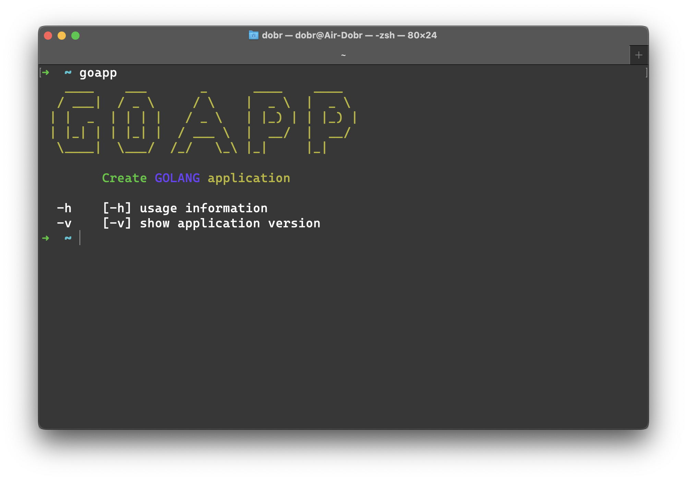
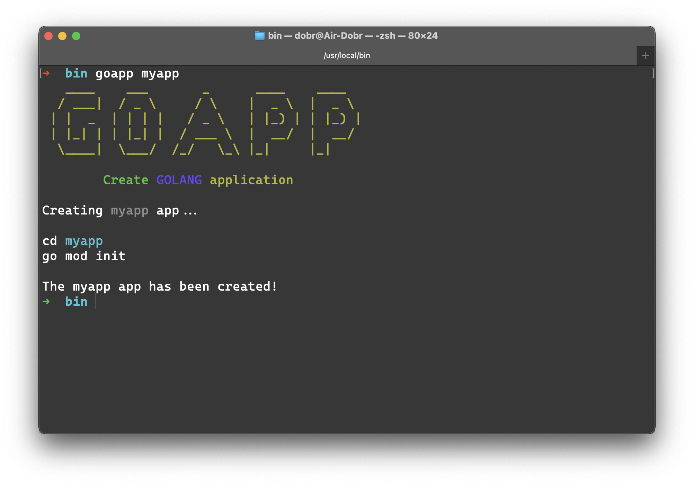
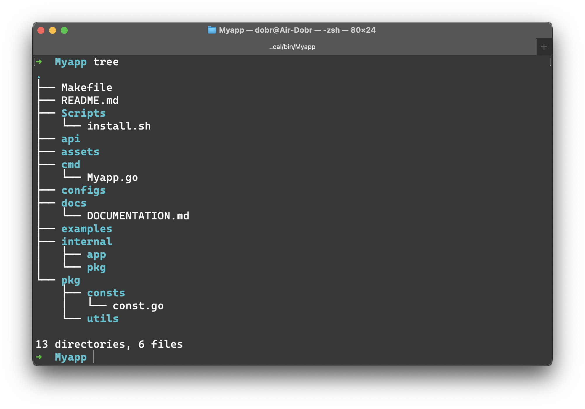
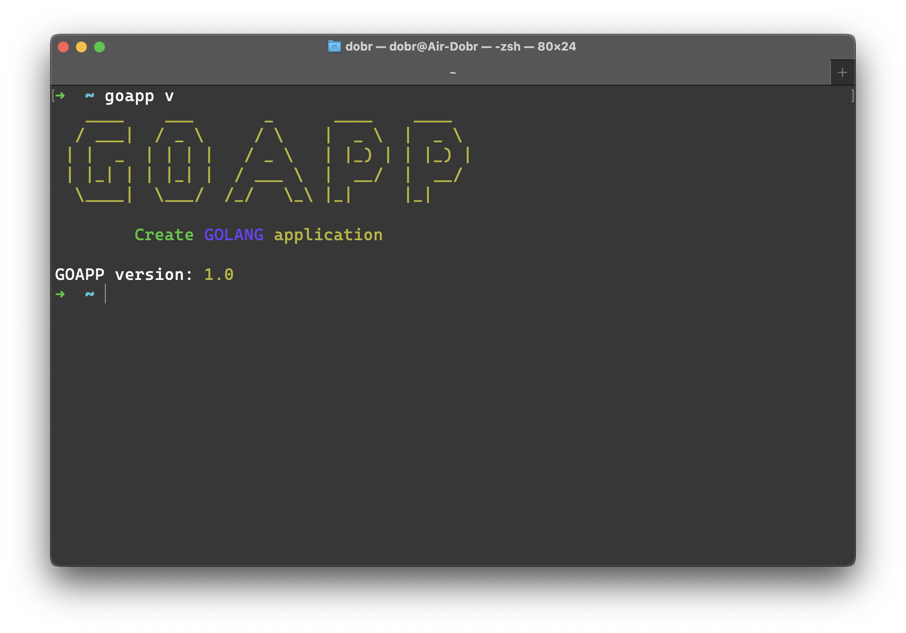

# GOAPP



### An application to create a golang applications with minimal Template

## INSTALLATION

```bash
git clone https://github.com/Avdushin/Goapp
cd Goapp
# Linux
./linux-install.sh
# Mac OS
./darwin-install.sh
# Start app
goapp
```

### HOW TO USE

```bash
goapp MyApp
```



### APP TREE



### Version

